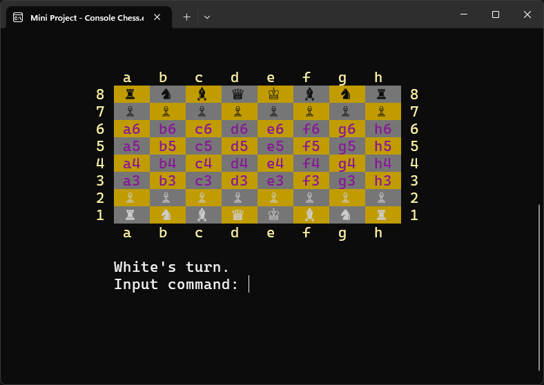
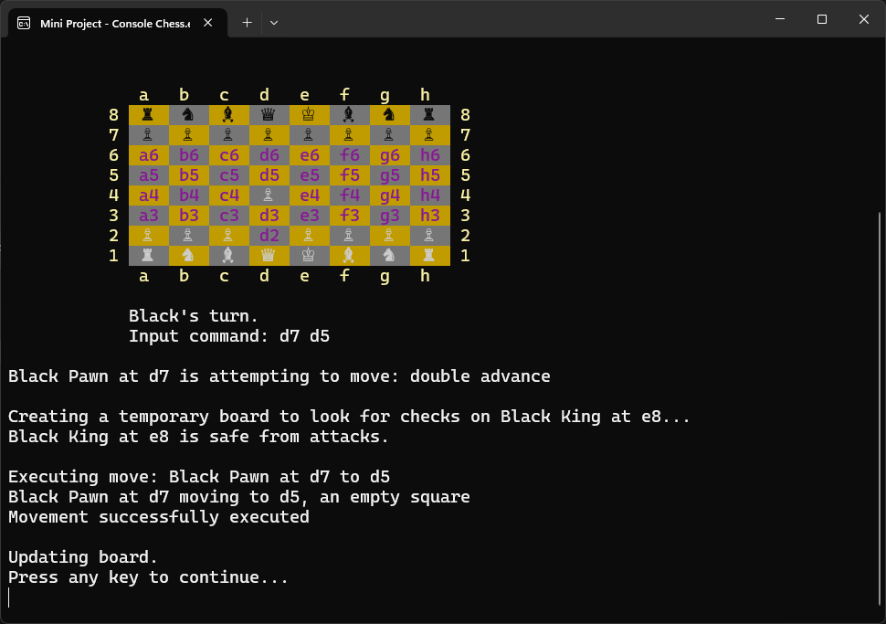
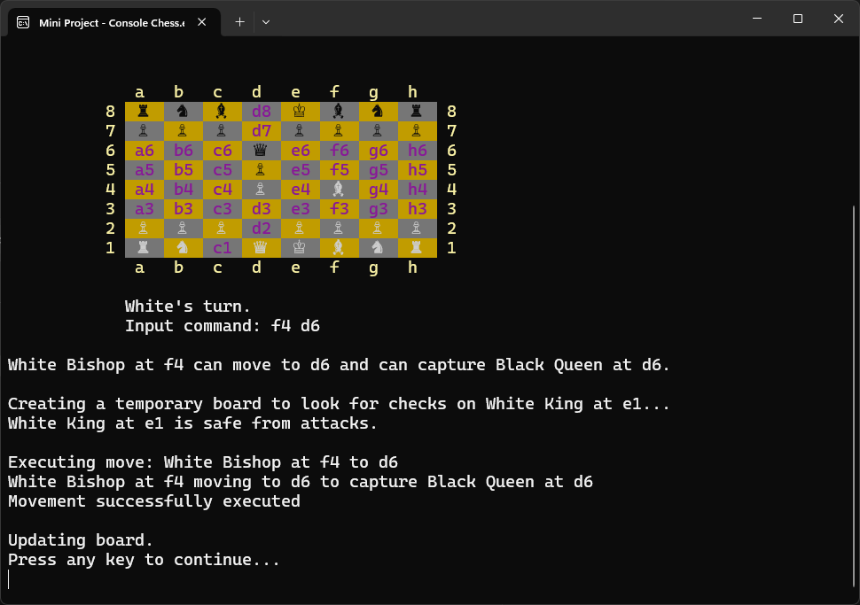
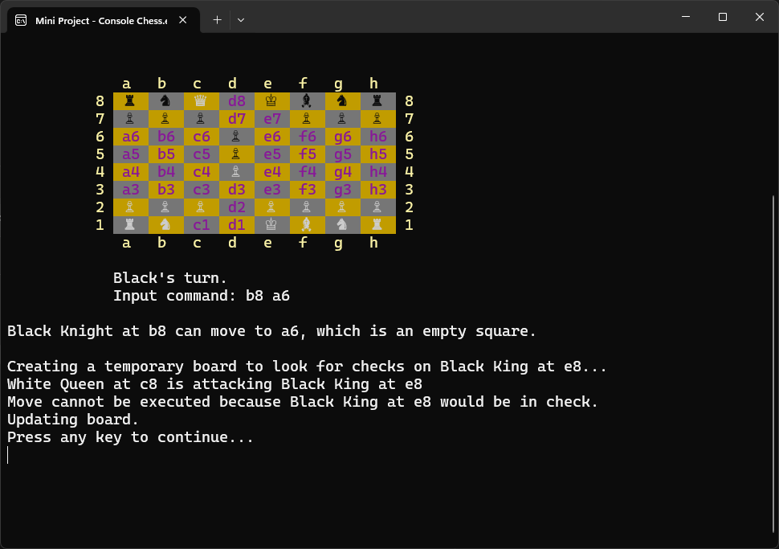
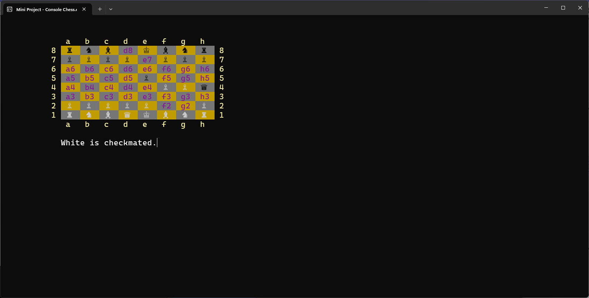

# Mini Project - Console Chess
This is chess played in console, coded in C# using `.NET 8.0`. This was written as the mini project for MSSA PCAD17 cohort.

## Interface

To move pieces, type start position and end position (i.e. `d2 d4`)

Algebraic move notations are not supported at this time.

`quit` to concede.

## Demo
[Demo Video](https://soomin-song-mssa-pcad17.github.io/Mini-Project---Console-Chess/)

## Classes

### `ChessboardBackend`

Stores and updates game state

Gets passed into move validation

### `ChessboardUI`

Presents information to user

When initialized, also initializes `Backend`

Receives user input and communicates with backend

### `Coordinate`

Holds `Rank` and `File` data

Allow conversion between algebraic notation and array notation

### `Move`

Holds `Piece`, `StartPosition`, `EndPosition` data

Handles Move validation and execution logic

### `Piece`

Holds `PieceColor`, `PieceType`, and `Position`.

When a piece is captured, it's sent to [-1,-1], and IsCaptured returns `true`.

### `Square`

Holds `Position` and `Occupant` (`Piece`) data
